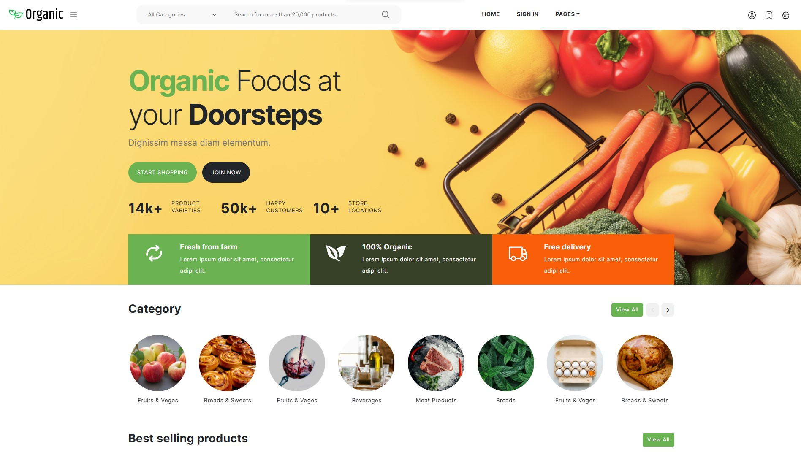
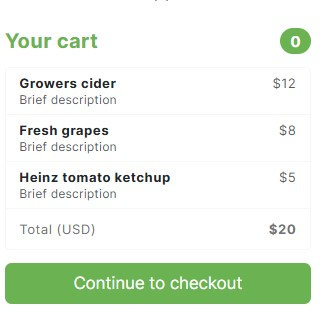
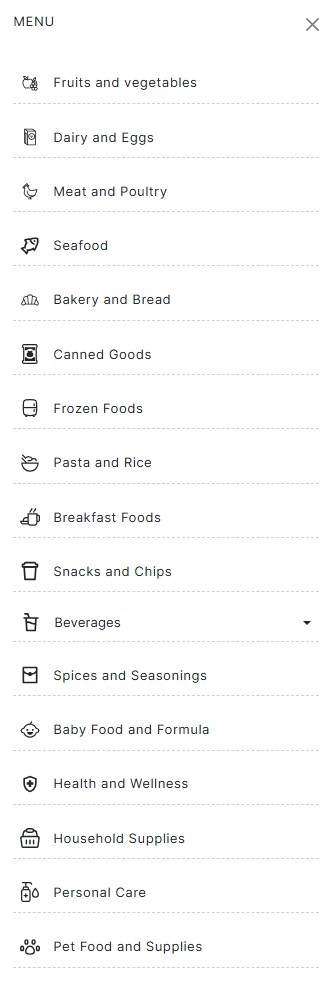
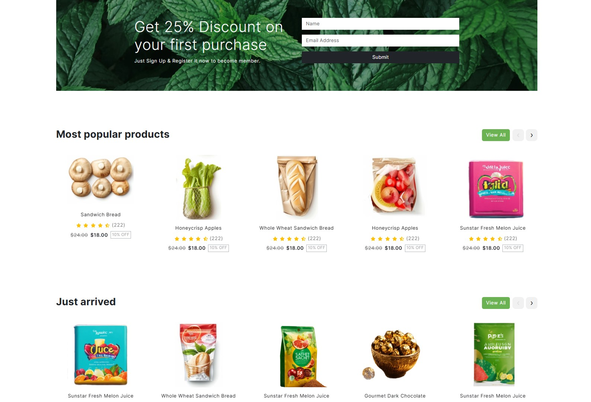

## 🛒 Django Organic Store Web Application

This project is a **Django-based web application** created by converting a **free HTML/CSS template** into a dynamic Django project.  
It demonstrates how a static frontend theme can be structured, managed, and extended using **Django’s backend architecture**.

## 📸 Project Screenshots
<div align="center">
<table>
  <tr>
    <td colspan="3" align="center">
      
    </td>
  </tr>

  <tr>
    <td align="center">
      
    </td>
    <td align="center">
      
    </td>
    <td align="center">
      
    </td>
  </tr>
</table>
</div>

## 📌 Project Overview

- 🔁 Converted from static HTML/CSS to a Django project
- 🧩 Organized templates, static assets, and Django apps
- ⚙️ Ready for backend features like authentication, database models, and admin panel
- 🎨 Retains original UI while enabling server-side rendering

This project can be used as:
- A **starter Django website**
- A **learning project for Django beginners**
- A **base template for client or academic projects**

---
## 🔄 Modifications Made

Compared to the original static template, the following changes were made:

- ✅ Integrated Django project structure
- ✅ Added Django app for routing and views
- ✅ Prepared static asset folders (`css`, `js`, `images`)
- ✅ Enabled Django template rendering
- ✅ Organized files for scalability and maintenance

> ⚠️ This repository does **not redistribute the template as-is**.  
> It represents a **Django adaptation and implementation** of the original design.

---

## 🛠️ Tech Stack

- **Backend**: Django (Python)
- **Frontend**: HTML5, CSS3, Bootstrap
- **Template Engine**: Django Templates
- **Database**: SQLite (default)

---

## 📁 Project Structure
```
organic-store-django/
├── manage.py                 # Django management script
├── db.sqlite3                # SQLite database
├── index.html                # Converted main HTML template
├── style.css                 # Custom styles
├── css/                      # CSS assets
├── js/                       # JavaScript assets
├── images/                   # Image assets
├── organic_theme/            # Django app
│   ├── views.py
│   ├── urls.py
│   └── templates/
├── siteproj/                 # Django project settings
│   ├── settings.py
│   ├── urls.py
│   └── wsgi.py
├── README.md                 # Project documentation
├── readme.txt                # Original template license & notes
```
## 🎨 Template Source & Attribution

This project is based on a **free HTML/CSS template** provided by:

**TemplatesJungle.com**  
🔗 https://templatesjungle.com/

> The template is **free for both personal and commercial use**, provided the **credit link to TemplatesJungle.com is retained** in the footer.
